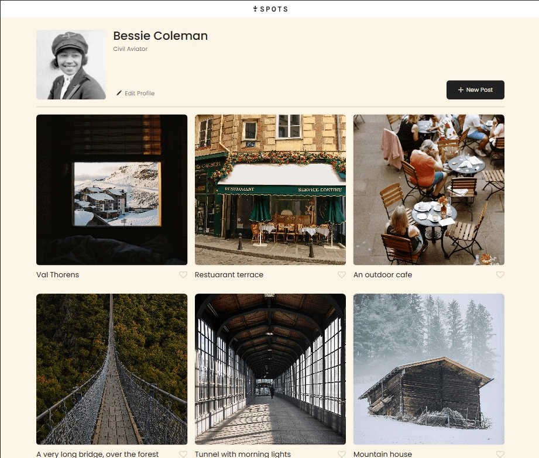
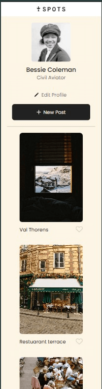

# Project 3: Spots

## Description

Spots is a responsive social media profile page, designed and built as part of TripleTen’s Software Engineering program.

This project displays a user profile along with a grid of image cards — mimicking the layout of a real-world photo-sharing platform. It's fully responsive across desktop, tablet, and mobile devices.

Users can:
- View a user profile with avatar and description
- Browse location-based image cards
- Interact with buttons using hover effects
- Experience a smooth layout on all screen sizes

---

## Technologies Used

- **HTML5** – semantic layout and accessibility
- **CSS3** – styling with Flexbox, Grid, and BEM methodology
- **Responsive Design** – media queries for mobile/tablet layouts
- **Git** – version control
- **GitHub Pages** – deployment
- **Figma** – visual design reference

---

## Screenshots

### Desktop Layout

### Mobile Layout

---

## Figma File

[Design file on Figma](https://www.figma.com/file/BBNm2bC3lj8QQMHlnqRsga/Sprint-3-Project-%E2%80%94-Spots?type=design&node-id=2%3A60&mode=design&t=afgNFybdorZO6cQo-1)

---

## Project Demo Video

[Watch my walkthrough video](https://youtu.be/vylsIF_VnfU)

---

## Notes

- Images were exported from Figma and optimized via [TinyPNG](https://tinypng.com) to reduce load time.
- The code is written using the BEM naming convention and is modular and scalable.
- Responsive design was tested across multiple breakpoints including 768px and 480px.

---

## Getting Started

To run this project locally:
1. Clone this repo:  
   `git clone https://github.com/salemfranciskaiser/se_project_spots.git`
2. Open `index.html` in your browser.

---

